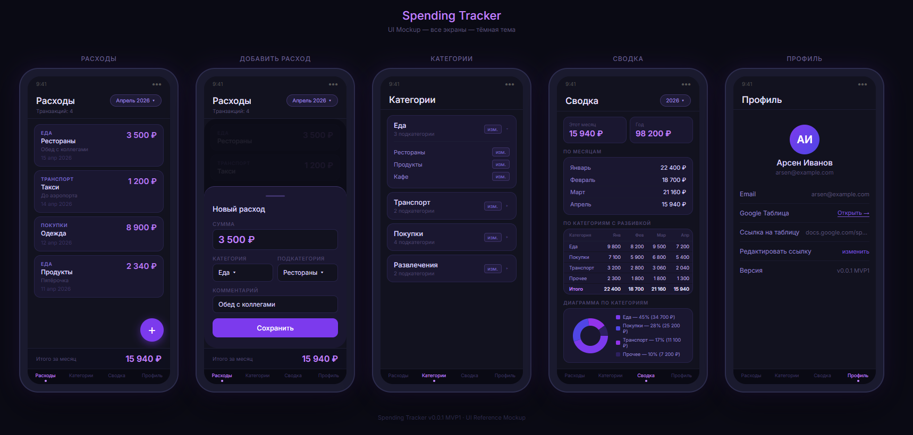

# Spending Tracker Android

Приложение для учёта личных расходов с синхронизацией в Google Sheets.

**Версия**: v0.0.1 (MVP1) - 01.05.2026

## Архитектура

- **Domain**: Бизнес-логика и модели.
- **Data**: Room (локальный кэш) + Ktor (REST API).
- **Presentation**: Jetpack Compose + MVVM.
- **DI**: Koin.

## Технологии

- **Kotlin**: 2.3.21
- **JDK**: 17
- **Android SDK**: 37
- **Jetpack Compose**: BOM 2026.04.01
- **Room**: 2.8.4
- **Ktor**: 3.4.3
- **Koin**: 4.2.1

## Модули проекта

| Модуль | Статус | GitHub                    |
|--------|--------|---------------------------|
| `backend` | ✅ Готов | https://github.com/Terpsihoransk/spending_tracker |
| `android` | ✅ Готов | https://github.com/Terpsihoransk/spending-tracker-android |

## Документация

- [Инструкции для агентов](AGENTS.md)
- [Спецификация](documentation/api_specification.md)
